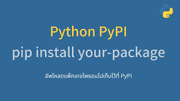

# Upload-Package-To-Pypi

<p align = 'center'></p>

### Table of Contents
1. [Installation](#installation)
2. [Project Motivation](#motivation)
3. [File Descriptions](#files)
4. [Licensing, Authors, and Acknowledgements](#licensing)

## Blog Post
Here is the link to my blog post in Medium, describing the steps to upload any custom package to PyPi.

[Upload package to PyPi](https://medium.com/@rahulgupta1/upload-your-python-package-to-pypi-c45ad6a52a13)

## Installation <a name="installation"></a>
I have created and uploaded a package in PyPi named "nearest-square". You can install this package by running the following command.

`pip install nearest-square`

## Project Motivation<a name="motivation"></a>

For this project, I was interested in creating and publishing a simple package to PyPi so that any Python programmer could install and use my package. Pypi is a repository of software for the Python programming language. It is used by Python developers to publicize and share their software.

Since the objective was to learn how to upload a package to PyPi and make it available for general public, I chose to have a very basic Python module in the form of calculating nearest-squares.

The package can be used by all Python users after installing it. Below is a sample usage:

```
>>> from nearest_square import nearest_square as nsqr
>>> nsqr(101)
100
```

## File Descriptions<a name="files"></a>

* nearest_square: Includes all package files
    * `__init__.py` : Initialization file
    * `nearest_square.py` : Python file containing actual program/code
    * `setup.cfg` : Setup file

* `setup.py` : Contains name of the package and author's information

* `license.txt` : License information


## Licensing<a name="licensing"></a>
Author: Rahul Gupta
Copyright 2020

Permission is hereby granted, free of charge, to any person obtaining a copy
of this software and associated documentation files (the "Software"), to deal
in the Software without restriction, including without limitation the rights
to use, copy, modify, merge, publish, distribute, sublicense, and/or sell
copies of the Software, and to permit persons to whom the Software is
furnished to do so, subject to the following conditions:

The above copyright notice and this permission notice shall be included in all
copies or substantial portions of the Software.

THE SOFTWARE IS PROVIDED "AS IS", WITHOUT WARRANTY OF ANY KIND, EXPRESS OR
IMPLIED, INCLUDING BUT NOT LIMITED TO THE WARRANTIES OF MERCHANTABILITY,
FITNESS FOR A PARTICULAR PURPOSE AND NONINFRINGEMENT. IN NO EVENT SHALL THE
AUTHORS OR COPYRIGHT HOLDERS BE LIABLE FOR ANY CLAIM, DAMAGES OR OTHER
LIABILITY, WHETHER IN AN ACTION OF CONTRACT, TORT OR OTHERWISE, ARISING FROM,
OUT OF OR IN CONNECTION WITH THE SOFTWARE OR THE USE OR OTHER DEALINGS IN THE
SOFTWARE.
